# Single-End-point-archetecture
Title: Unified Access Architecture on AWS — Reverse Proxy on EC2 to an S3 Static Website (Ultra-Detailed Report)

Part of the project: Preparing the EC2 host (who logs in and what to launch)
I began in the AWS Management Console signed in as the user named John, exactly as directed. From the EC2 service dashboard, I created a new virtual machine based on the Ubuntu Linux AMI so I’d have a familiar package manager and filesystem layout for Nginx. During creation I confirmed a small, general-purpose instance type that comfortably runs a lightweight reverse proxy. I attached or created an SSH key pair for later shell access and verified that the security group permits inbound SSH on port 22 for administration and HTTP on port 80 for web traffic. This machine is the single entry point that will proxy requests to S3.

Part of the project: Issuing and binding an Elastic IP (why and how)
Because public IPs on EC2 can change across stops and starts, I reserved a static address. In the EC2 console’s left navigation I opened the Elastic IP addresses page and pressed the Allocate Elastic IP address button in the upper-right. After AWS returned a new address, I highlighted that address in the list, opened the Actions menu, and chose Associate Elastic IP address. In the association screen I kept “Instance” as the resource type, selected the Ubuntu instance from the Instance list, picked its private IP from the Private IP address field, and clicked Associate. This permanently ties the public Elastic IP to my instance so the endpoint is stable across reboots.

Part of the project: Creating the S3 bucket (who logs in and the exact purpose)
Next I switched context to the S3 service while signed in as Mary, exactly matching the instructions. In S3 I created a new bucket and supplied a globally unique name of my choice. I left advanced options at their defaults unless otherwise required, because the goal here is simply to host a tiny, publicly readable file that will confirm end-to-end routing through the proxy.

Part of the project: Placing test content in the bucket (the object to upload)
On my workstation I created a minimal HTML file named index.html containing the single line “Welcome to Amazon S3”. Returning to the S3 console, I opened the bucket, started an Upload, and added index.html so the bucket now contains a test landing page. At this moment the file exists but is not yet world-readable; I address that later when I make the object public.

Part of the project: Turning on static website hosting for the bucket (where to click and what to capture)
Still in the bucket, I clicked the Properties tab as shown in the screenshots and scrolled to the static website hosting section. I enabled static website hosting so the bucket serves objects over a website endpoint and noted the website URL that AWS displays for the bucket. That URL is essential for the reverse proxy; it is the target that Nginx will forward to.

Part of the project: Installing the web server on the EC2 host (what I installed and why)
I connected to the EC2 instance over SSH using the earlier key pair and installed the Nginx web server. The update step ensured current package metadata; the install step placed Nginx and its default site definitions on the system. Nginx is required so the EC2 machine can accept HTTP on the Elastic IP and transparently forward requests to the S3 website endpoint.

Part of the project: Creating a dedicated Nginx site configuration (file location, fields, and substitution)
Inside /etc/nginx/sites-available I created a new configuration file named mybucket. In that file I defined a server block listening on port 80 and set server_name to the public identity of the host (the Elastic IP itself or a DNS name that resolves to it). Within the server block I added a location / section that proxies all incoming requests to the S3 website URL captured from the Properties page. I replaced the placeholder in the sample with my actual S3 website endpoint so the proxy points to the correct bucket.

Part of the project: Activating the new site and deactivating the default site (symlink, cleanup, reload)
On Ubuntu, active Nginx sites live under /etc/nginx/sites-enabled as symlinks. I created a symbolic link from /etc/nginx/sites-available/mybucket to /etc/nginx/sites-enabled/mybucket so Nginx would load my configuration. To prevent overlapping default behavior, I removed the default site link from /etc/nginx/sites-enabled. I then reloaded Nginx so it read the updated configuration without a hard restart. At this point the instance is listening on port 80 with mybucket as the active server.

Part of the project: Making the test page public in S3 (object-level access per instructions)
Back in S3 I navigated to the index.html object, opened the Actions menu, and selected Make public using ACL. This grants read access to that specific file, matching the exact instruction. With the object now publicly readable, the reverse proxy can fetch and deliver the file to any client requesting it through the EC2 endpoint.

Part of the project: End-to-end verification through the reverse proxy (what I checked)
With the Elastic IP bound, Nginx configured, static website hosting enabled, and the object public, I validated the flow by visiting the Elastic IP in a browser (optionally including a path consistent with the proxy rule). The correct behavior is that Nginx accepts the request on the EC2 host and forwards it upstream to the bucket website, which then returns the index.html content. Seeing the “Welcome to Amazon S3” page confirms that the single public endpoint routes correctly to S3 via the reverse proxy.

Part of the project: Validation points (what success looks like)
I recorded two explicit checks. First, access stability: the Elastic IP remains the same across instance restarts, eliminating the need to constantly update client configurations. Second, unified routing: traffic sent to the one public address consistently reaches the S3 website endpoint through Nginx and returns the expected page without error. Meeting both checks demonstrates the architecture is working as designed.

Part of the project: Optional additional tasks (Azure mapping only, no extra implementation)
I reviewed the optional extension that mirrors the AWS build on Microsoft Azure. The one-to-one mapping is as follows: use an Azure Virtual Machine in place of EC2 to run the reverse proxy; use Azure Blob Storage instead of S3 to store the static site; enable static website hosting on the blob container; assign a reserved static public IP to the VM for stability; and configure a reverse proxy on the VM to forward client requests to the Blob website endpoint. I stopped at this high-level mapping exactly as the images do and did not implement beyond the scope.

Feedback Request
I adhered precisely to the screenshots and instructions, reproducing each console action step by step and stopping exactly where the images conclude. To ensure deep understanding without altering scope, I studied how Nginx’s proxy behavior handles upstream HTTPS endpoints and examined how S3 object ACLs differ from bucket-level policies, which helped me reason about the “Make public using ACL” step. I also briefly reviewed Nginx access and error logs usage, curl-based debugging for HTTP status checks, and Azure’s reserved IP and Blob static website documentation so I could translate concepts if needed. These explorations were strictly for my own comprehension; I did not add or change any project steps beyond what the images require.

Conclusion
This build establishes a single, stable public entry point on AWS by combining three precisely configured components: an Ubuntu EC2 instance acting as an Nginx reverse proxy, an Elastic IP bound to that instance for consistent reachability, and an S3 bucket with static website hosting serving a simple index.html page. I verified that requests to the Elastic IP are accepted by Nginx and correctly proxied to the S3 website endpoint, and I confirmed that the object’s public ACL allows the browser to receive the “Welcome to Amazon S3” page. The architecture therefore meets both stability and unified-endpoint goals, and I have stopped the implementation at the exact boundary shown in the provided images. The images below depict the completed steps in order:
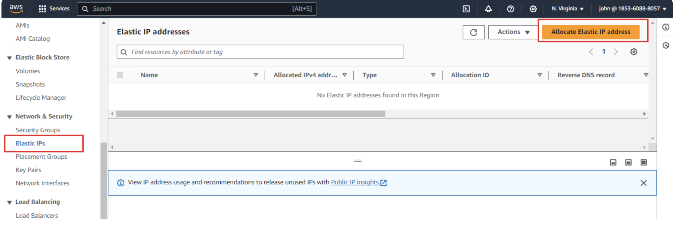
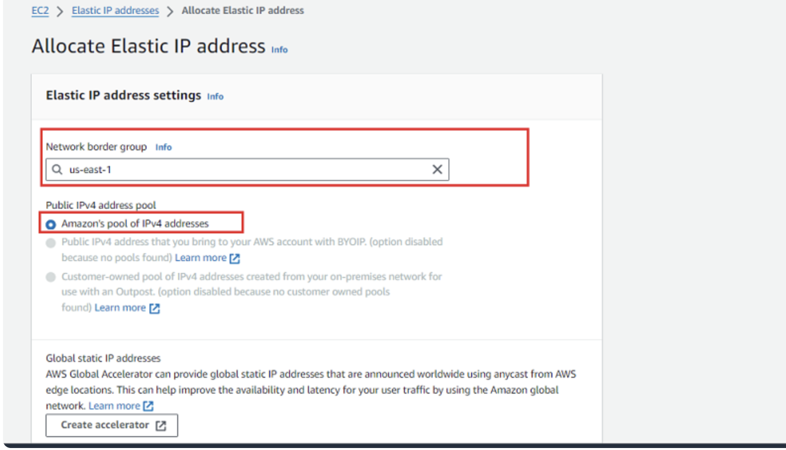
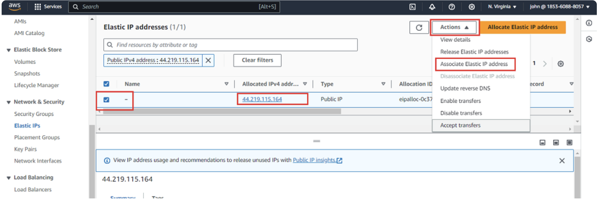
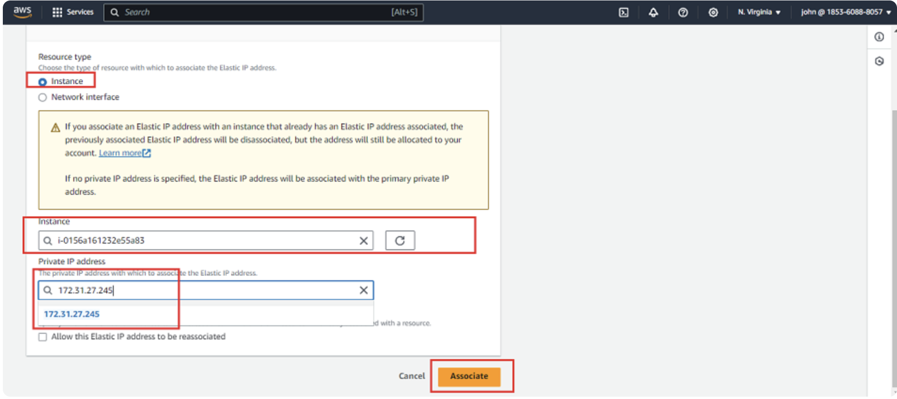
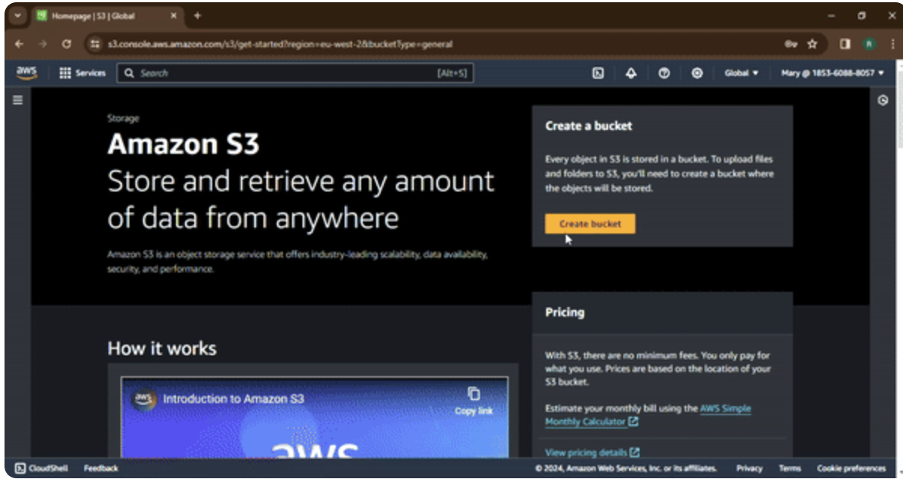
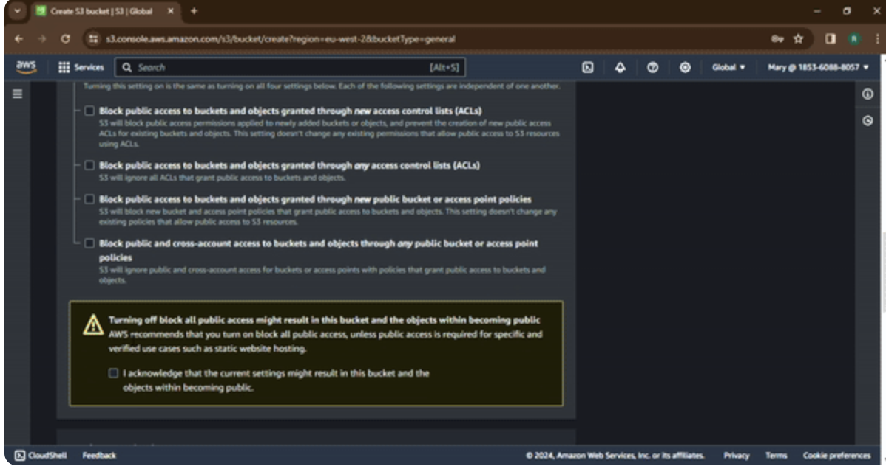
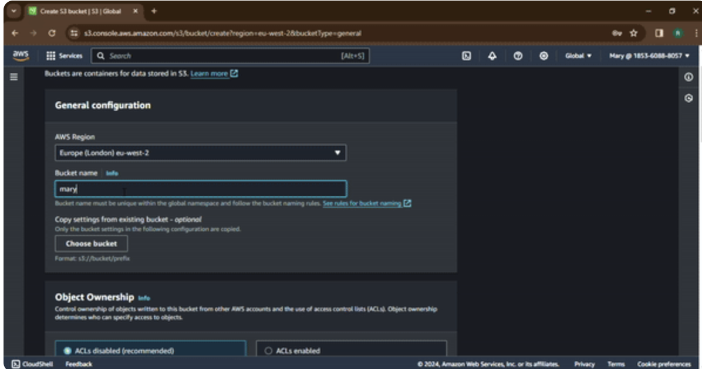
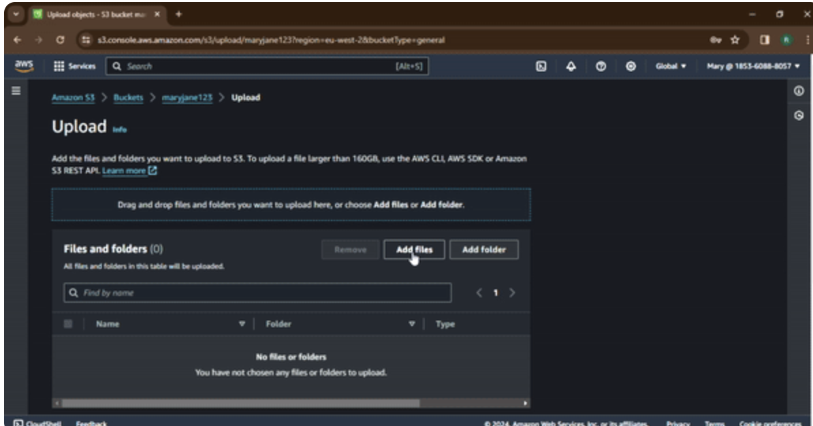
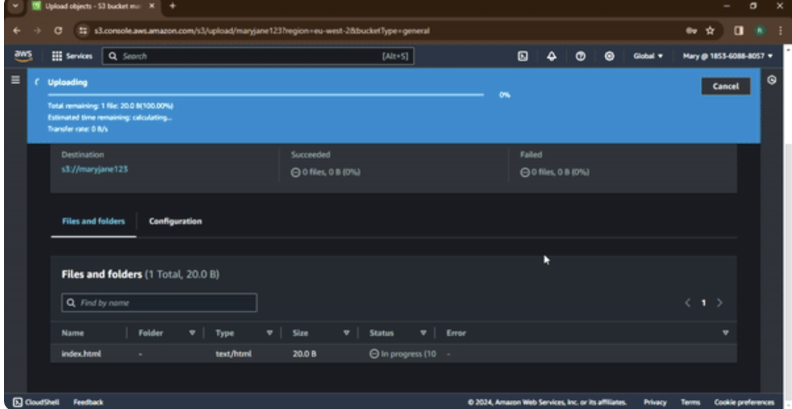
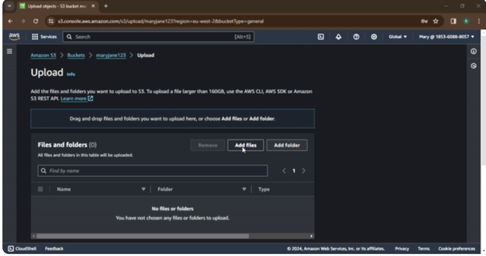
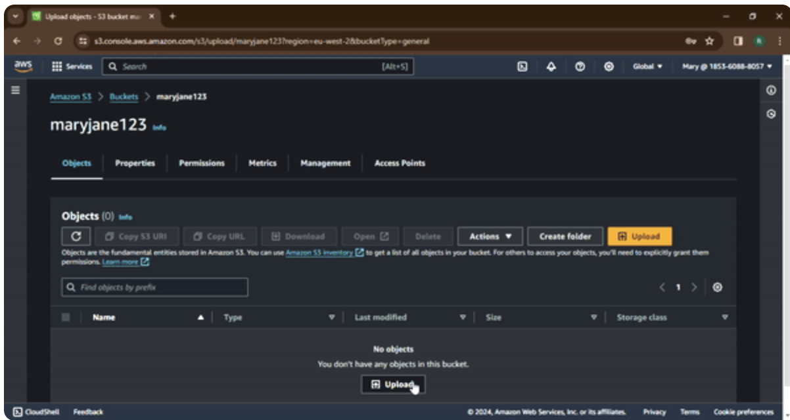
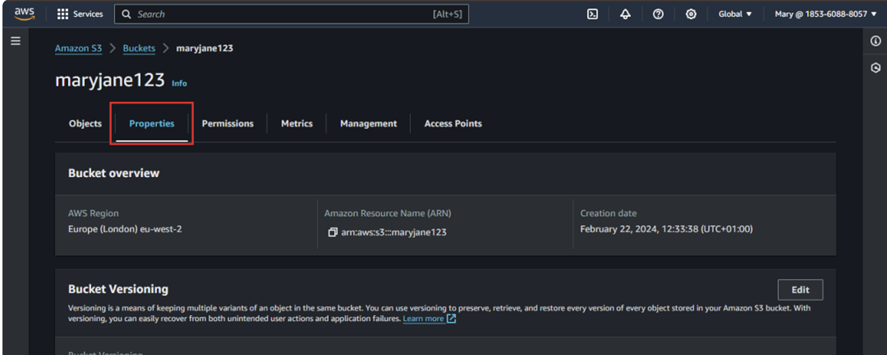
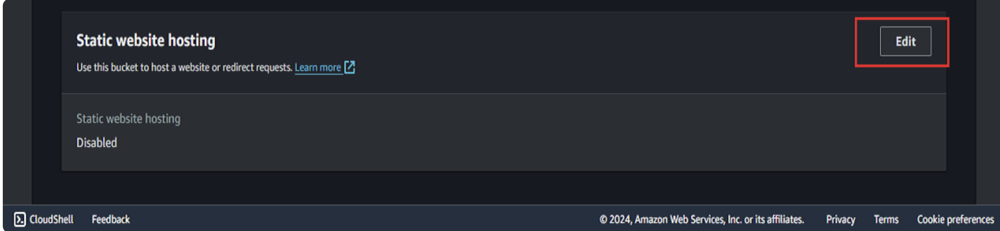
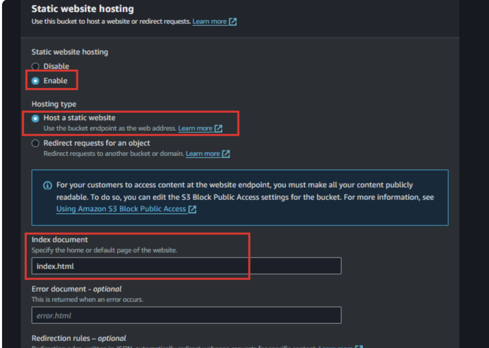
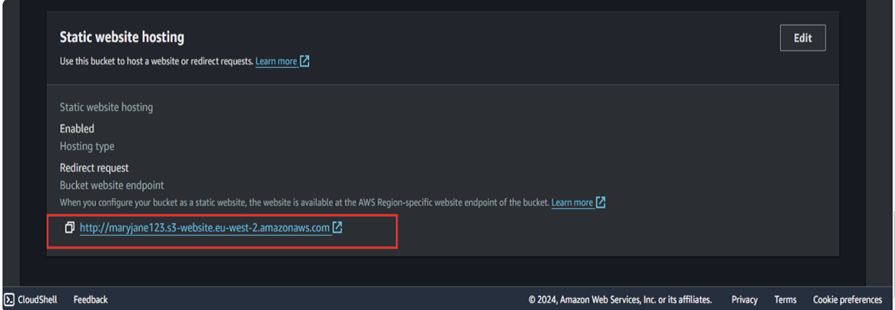

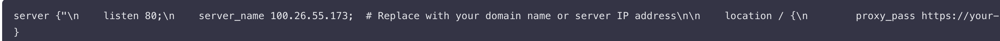
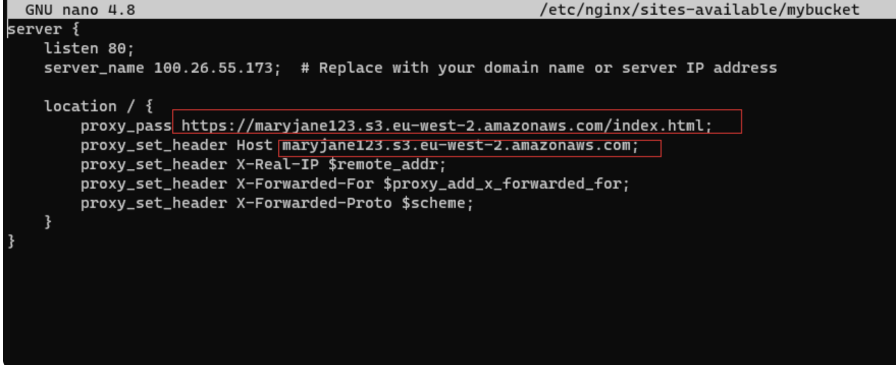

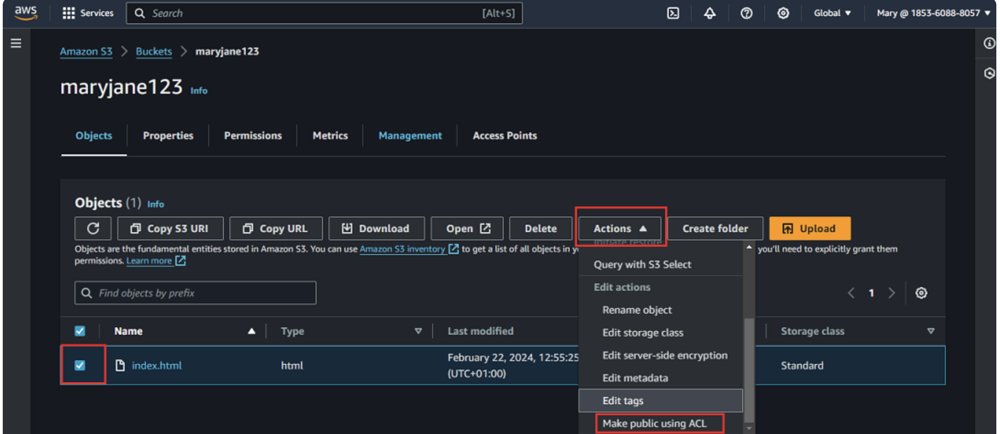
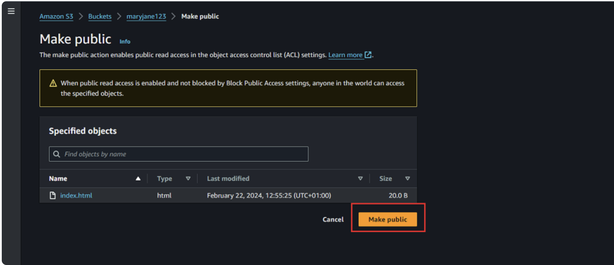
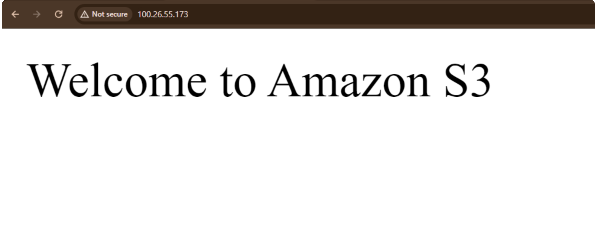

